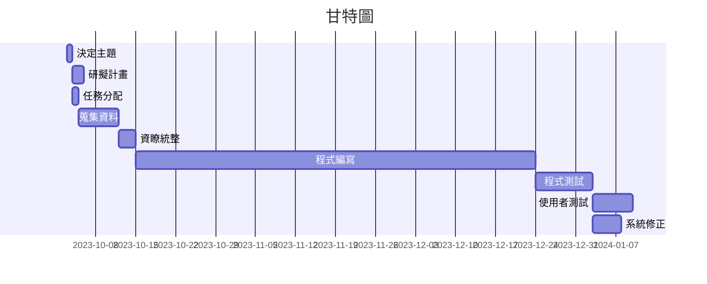

# Team13
專題名稱:記帳拆帳APP  
組長:c110118229 王翔  
組員:c110118222 邱楊智、c110118224 賴蔚霆  
專題簡介:  
現代流行的快時尚或物價的通膨常常造成大眾無法好好存到積蓄，剛賺到的錢將近月底就花光了，因而衍伸出新的詞彙月光族，這代表著許多人對於財產帳務的控制不太在行才會造成這種情形，因此我們希望製作簡單操作的記帳app，讓大家能開始重視自己的金錢流向以達到開源節流的目的。你是否曾經和朋友出去旅遊時因為金額分配不均而造成爭執，因此本小組希望能夠研發出拆帳功能，透過簡單的步驟快速紀錄，並正確地把金額平均分攤，最後明確的顯示出誰該付錢或收錢不僅守護好大家的感情也守住了荷包。我們預計透過android studio搭配SQLite製作出程式的架構，並透過簡化流程及美術編輯製作出簡易又上手的app讓大家使用。

### 分工表
|  *編號*  |  *任務內容*  |  *所需時(天)*  |  *前置任務*  |  *負責人*  |
| :------: |   :------:  |    :------:   |   :------:  |  :------:  |
|     1    |   決定主題   |       1       |      /      |王翔、邱楊智、賴蔚霆|
|     2    |   研擬計畫   |       2       |      1      |王翔、邱楊智、賴蔚霆|
|     3    |   任務分配   |       1       |      1      |王翔、邱楊智、賴蔚霆|
|     4    |   蒐集資料   |       7       |      3      |王翔、邱楊智、賴蔚霆|
|     5    |   資料統整   |       3       |      4      |王翔、邱楊智、賴蔚霆|
|     6    |   程式編寫   |       70      |      5      |王翔、邱楊智、賴蔚霆|
|     7    |   程式測試   |       10      |      6      |王翔、邱楊智、賴蔚霆|
|     8    |  使用者測試  |       7       |      7      |王翔、邱楊智、賴蔚霆|
|     9    |  系統修正    |       5       |      7      |王翔、邱楊智、賴蔚霆|
---
### 甘特圖

# pert 圖
 

# 關鍵路徑
1->2->4->5->6->7->8
