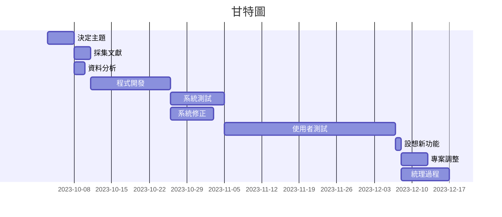

# Team13
專題名稱:王翔的訓練計畫  
組長:c110118229 王翔  
組員:c110118222 邱楊智、c110118224 賴蔚霆  
專題簡介:要猛  
### 分工表
|  *編號*  |  *任務內容*  |  *所需時(天)*  |  *前置任務*  |  *負責人*  |
| :------: |   :------:  |    :------:   |   :------:  |  :------:  |
|     1    |   決定主題   |       1       |      /      |王翔、邱楊智、賴蔚霆|
|     2    |   研擬計畫   |       2       |      1      |王翔、邱楊智、賴蔚霆|
|     3    |   任務分配   |       1       |      1      |王翔、邱楊智、賴蔚霆|
|     4    |   蒐集資料   |       7       |      3      |王翔、邱楊智、賴蔚霆|
|     5    |   資料統整   |       3       |      4      |王翔、邱楊智、賴蔚霆|
|     6    |   程式編寫   |       70      |      5      |王翔、邱楊智、賴蔚霆|
|     7    |   程式測試   |       10      |      6      |王翔、邱楊智、賴蔚霆|
|     8    |  使用者測試  |       7       |      7      |王翔、邱楊智、賴蔚霆|
---
### 甘特圖

